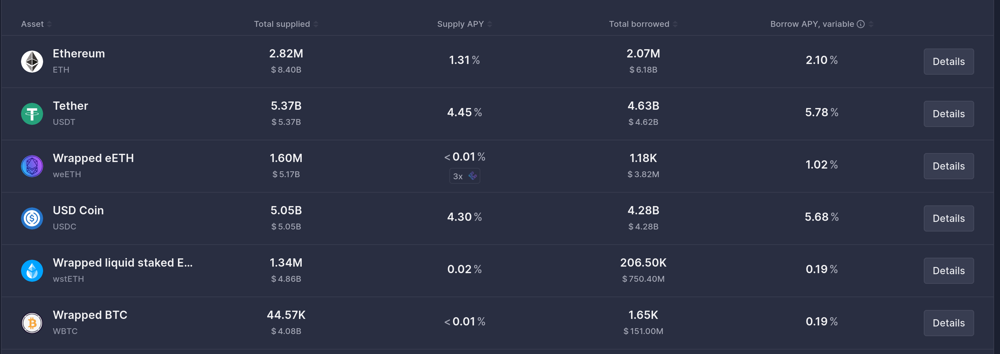

# Money Markets

Money markets são mercados que permitem empréstimo colateralizado. A interface é a seguinte:

O protocolo define parâmetros que estabelecem a taxa de juros em função da utilização do ativo:

https://app.aave.com/reserve-overview/?underlyingAsset=0xdac17f958d2ee523a2206206994597c13d831ec7&marketName=proto_mainnet_v3

Para manter a integridade do protocolo, cada protocolo ativo define uma parâmetros para liquidação. Por exemplo, no USDT temos os seguintes parâmetros:

Max LTV: 75%
Liquidation Threshold: 78%
Liquidation Penalty: 4.5%
Reserve Factor: 10%

Nesse caso, com $1000 em USDT depositados, o usuário poderia pegar um empréstimo de até $750 em outros tokens, como WBTC. Caso a moeda emprestada se valorize e o valor devido chegue a $780, o protocolo automaticamente coloca à venda parte do colateral para pagar metade da dívida. A "multa" de 4.5% serve para recompensar os "liquidadores", incentivando-os a agir rápido e manter a integridade do protocolo.

Entre os juros gerados pelos empréstimos, 10% é coletado pelo protocolo, fazendo parte de reservas de segurança e recompensas no ecossistema, e 90% é distribuído entres os depositantes.

Para manter a segurança dos depósitos, evitando riscos que poderiam acontecer devido à mudanças bruscas de parâmetros, qualquer mudança é sujeita ao processo de governança. Que no caso do AAVE v2, é:

1. **PROPOSTA** - Holder com >80K AAVE submete proposta no fórum de governança

2. **DISCUSSÃO** - Comunidade debate por 5-7 dias, refinando a proposta

3. **VOTAÇÃO** - Votação on-chain por 3 dias. Quórum mínimo: 320K AAVE

4. **EXECUÇÃO** - Se aprovada (>50%), execução automática após timelock de 24h 

Portanto qualquer mudança precisa de que grupos com quantidades significativas de tokens (e portanto com interesses alinhados ao crescimento do protocolo no longo prazo) proponham e aprovem as mudanças. E o timelock de 24h permite que qualquer pessoa afetada pelas mudanças possa se adequar a tempo. Reduzindo significativamente os incentivos e mecanismos de ação para um possível ataque.

Nesse protocolo, o token de governança tem exclusivamente esta função. Em outros, como Venus, investimento no token de governança garante melhores condições de empréstimo.
